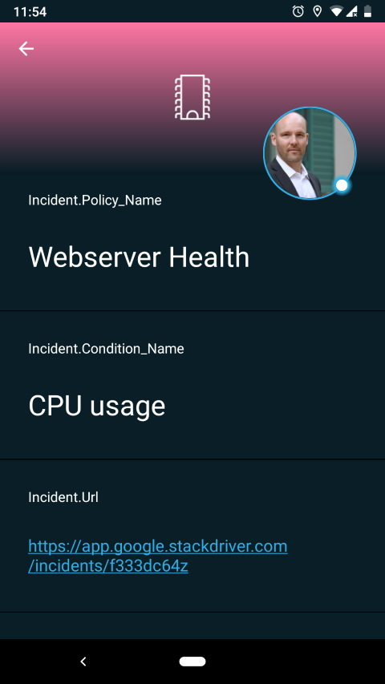
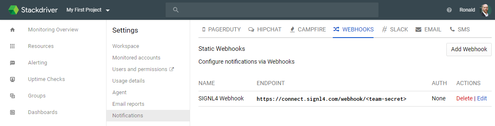
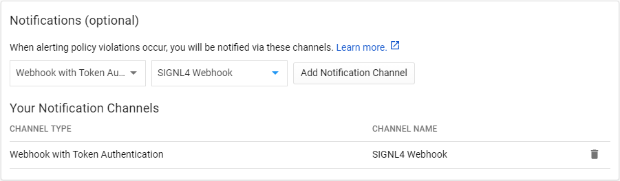

# Mobile alerting with tracking & escalation for Google Stackdriver
 
## Why SIGNL4
 
Google Stackdriver is a cloud-based systems management service offering performance and diagnostics data to public cloud users. 

It provides access to logs, metrics, traces, and other signals from infrastructure platforms, virtual machines, containers, middleware, etc. with the objective to track issues all the way from the end user to backend services and infrastructure. Pairing this Stackdriver with SIGNL4 can enhance your daily operations with an extension to your mobile team in the field or on the shop floor.
 

## How it Works
 
In order to pair Google Stackdriver and SIGNL4 you can use the alerting capabilities in Stackdriver. Here you can configure the SIGNL4 webhook and whenever there is an alert it is then forwarded to SIGNL4.

Integration Capabilities
- IT staff is alerted via mobile push, text and voice
- Staff can acknowledge and take ownership for critical events that occur
- Alerts are escalated in case of no response
- Communicate within an alert to address a particular problem
- Inbound webhook and email establishes connection from Stackdriver to a SIGNL4 team
 
Scenarios
- IT status forwarding
- Industrial Data
- DevOps
 
## Hot to integrate
 
### Integrating SIGNL4 with Google Stackdriver
 
Gathering events from IoT devices and sending team alerts in case of critical incidents is a broad field. It starts with simple prototypes using a Raspberry Pi and goes up to industrial IoT scenarios, machine data or distributed systems in the field.
 
The following example demonstrates the whole flow from an event on a device, through Google IoT Core and then notifying an engineer using SIGNL4.

SIGNL4 is a mobile alert notification app for powerful alerting, alert management and mobile assignment of work items. Get the app at https://www.signl4.com.

Cloud IoT Core is a fully managed service that allows you to easily and securely manage and connect your IoT devices. The integration with SIGNL4 is straightforward. In the following we will show an example on how to send alert notifications using SIGNL4 in case of MQTT events coming from devices in the field.

### Prerequisites
- A SIGNL4 (https://www.signl4.com) account
- Access to the Google Cloud Platform (https://console.cloud.google.com)

### Integration Steps

In order to setup the following flow quite some configuration steps are required.

#### Prepare Google Stackdriver

First of all go to your workspace in Stackdriver or create a new one at https://app.google.stackdriver.com.

#### Setup the SIGNL4 Webhook

Go to Workspace Settings -> Notifications -> Webhooks and create a new Webhook.

Here you just need to enter your SIGNL4 webhook URL. The <team-secret> is the specific team secret of your SIGNL4 team.

Click Test Connection to test the connection. You should then receive a SIGNL4 alert on your phone.

#### Add an Alerting Policy

In the Stackdriver console go to Alerting -> Alerting Policies and then click Add Policy.

Here you can specify the conditions on when to send the alert. And you can add Your Notification Channel. For the latter you can select Webhook with Token Authentication and then select the SIGNL4 notification channel you have configured in the previous step.

Then you can specify a name for the notification and click Save.

#### Ready to Go

This is it and now you will receive SIGNL4 alerts for any events and incidents matching your conditions.

If you would like to simulate event data you can do so for example using MQTT as descrived here: https://github.com/signl4/signl4-integration-google-iot.

You can also find the information at GitHub:
https://github.com/signl4/signl4-integration-google-stackdriver
